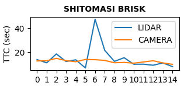

# SFND 3D Object Tracking

Welcome to the final project of the camera course. By completing all the lessons, you now have a solid understanding of keypoint detectors, descriptors, and methods to match them between successive images. Also, you know how to detect objects in an image using the YOLO deep-learning framework. And finally, you know how to associate regions in a camera image with Lidar points in 3D space. Let's take a look at our program schematic to see what we already have accomplished and what's still missing.


In this final project, you will implement the missing parts in the schematic. To do this, you will complete four major tasks: 
1. First, you will develop a way to match 3D objects over time by using keypoint correspondences. 
2. Second, you will compute the TTC based on Lidar measurements. 
3. You will then proceed to do the same using the camera, which requires to first associate keypoint matches to regions of interest and then to compute the TTC based on those matches. 
4. And lastly, you will conduct various tests with the framework. Your goal is to identify the most suitable detector/descriptor combination for TTC estimation and also to search for problems that can lead to faulty measurements by the camera or Lidar sensor. In the last course of this Nanodegree, you will learn about the Kalman filter, which is a great way to combine the two independent TTC measurements into an improved version which is much more reliable than a single sensor alone can be. But before we think about such things, let us focus on your final project in the camera course. 

## Dependencies for Running Locally
* cmake >= 3.1
* make >= 4.1 
* OpenCV >= 4.1
  * This must be compiled from source using the `-D OPENCV_ENABLE_NONFREE=ON` cmake flag for testing the SIFT detector
* gcc/g++ >= 5.4
* python >= 3.6 and its [`matplotlib`](https://matplotlib.org) package (optional, to launch the application with all combinations of detector/descriptor and to display performance charts)

## Build Instructions

1. Clone this repo `git clone https://github.com/fantauzzi/SFND_3D_Object_Tracking.git`
2. Make a build directory in the top level project directory: `mkdir build && cd build`
3. Compile: `cmake .. && make`

## Downloading the Dataset

Image detection relies on the [Yolo](https://pjreddie.com/darknet/yolo/) pre-trained neural network, whose weights need to be downloaded into directory `dat/yolo` in order to run the application.

From directory `dat/yolo` run:

```shell script
wget https://pjreddie.com/media/files/yolov3.weights
wget https://pjreddie.com/media/files/yolov3-tiny.weights
```

## Running Instructions

To **run the application** with a choice of keypoints detector and descriptor, in the `build` directory:
```shell script
./3D_object_tracking <detector> <descriptor> [on]
```
    
* `<detector>` is one of: `SHITOMASI`, `HARRIS`, `FAST`, `BRISK`, `ORB`, `AKAZE`, `SIFT`;
* `<descriptor>` is one of: `BRISK`, `BRIEF`, `ORB`, `FREAK`, `AKAZE`, `SIFT`;
* `on` is an optional argument, which requests to display matched keypoints, bounding boxes and a top view of the lidar data.

Not all combinations of detector and description are supported; in case, the program terminates with a notification message.

The application will save the computed time-to-collision (TTC) for camera and lidar in a text file named `stats_<detector>_<descriptor>.txt` under the `stats` directory, overwriting existing files as needed. Entries in the file are space separated. 

A Python script is available to **automate the launching of the application** with all the combinations of detectors and descriptors. In directory `script` run:
```shell script
python run_all
```  

After that, to **display charts** of the TTC from data saved by the application run, in the `script` directory:
```shell script
python charts.py
```

## Credits

Portions of starter code provided by Udacity as part of the Sensor Fusion Nanodegree program. 

## Project Rubric

Traceability of requirements for Udacity's Nanodegree project.

 ### FP.0 Final Report
 
 This README.
 
 ### FP.1 Match 3D Objects
 
 Function `matchBoundingBoxes()` matches each bounding box with at most one bounding box in the other frame. The same bounding box cannot be matched to more than one other bounding box; because the two frames may have a different number of bounding boxes, not every frame is necessarily matched. Moreover, matches that have low reliability are discarded. 
 
 To match bounding boxes, and choose the best matches, the implementation computes a statistic that I will refer to as *IOU*, as it is not very different from [Intersection over Union](https://www.coursera.org/lecture/convolutional-neural-networks/intersection-over-union-p9gxz).
 
 The statistic is computed for every pair of bounding boxes as 
 ```
       2 * Intersection
 IOU= -------------------
        Count1 + Count2
```
where `Intersection` is the total number of matches between keypoints in one bounding box and keypoints in the other bounding box; `Count1` is the number of keypoints in one bounding box that have been matched (to any other bounding box); `Count2` is the number of matched keypoints in the other bounding box.

All pairs of bounding boxes, one in each frame, are ranked based on the calculated IOU, and matches are established starting from the pair with the highest IOU. When a bounding box is matched, it is removed for the ranking, such that each bounding box can be matched at most once. Also, pairs of bounding boxes with an IOU under a set threshold are not matched, because unreliable. 
        
 * **FP.2 Compute Lidar-based TTC**
 
 The implementation is in function `computeTTCLidar()`. 
 
 To make the calculation of TTC robust toward outliers of the lidar points cloud, a set percentage of the points closest to the ego car, along its `x` direction, is ignored.   
 
 * **FP.3 Associate Keypoint Correspondences with Bounding Boxes**
 
 Function `clusterKptMatchesWithROI()` contains the implementation. Removal of outliers is operated subsequently in `computeTTCCamera()`, before proceeding with computation of the time-to-collision. 
 
 * **FP.4 Compute Camera-based TTC**
 
 Function `computeTTCCamera()` provides the  implementation. 
 
 In estimating the time-to-collision, it uses the median among keypoints reciprocal distance ratios, to mitigate the impact of outliers.
 
 
 
 * **FP.5 Performance Evaluation 1**
 
 Three frames with implausible lidar TTC estimate are frames no. 5, 6 and 7 (numbering the first frame where TTC is computed as 0). See pictures here below.
 
 
 
 
 
 
 
 A chart of the TTC over time (over frames) shows that the calculated TTC for lidar in frames 5, 6 and 7 is inconsistent with the same calculated in previous and subsequent frames, also inconsistent with the camera calculated TTC.
 
 
 
 The picture below highlights the lidar points used for calculation of the TTC from the car in front, from frame no. 4 to frame no. 9. One can see as the points cover the rear of the car at different heights in different frames, covering the bumber, the hatch and the plate to a varying degree.  
 
 
 
 Below a top view of the same lidar points, again frames from 4 to 9, with the ego camera at the bottom and traveling upward. The blue line corresponds to a distance of 8 meters from the ego car along its traveling direction. 
 
  
  
 Removal of the bottom percentile of the lidar points, while it removes outliers as intended, seems to be too aggressive in frame no. 5, and may be partly responsible for the inconsistent estimates of lidar TTC at frames 5 and 6. 
   
Overall, the lidar is accurate enough to pick differences in distance on the rear of the car, between hatch, bumper, plate, etc, which has thrown off the TTC estimates in some of the frames. Also, TTC accuracy may benefit by a less aggressive filtering of the outliers.
    
 * **FP.6 Performance Evaluation 2**
 
 A combined chart of the TTC over time (frames) for lidar and camera for all tested combinations of detectors and descriptors can be produced with the provided scripts. An example is here below and in the [repo](stats/chart.png). There is also a [spreadsheet](stats/stats.ods) that consolidates the same data used for the charts.
 
 
  
  The plot for lidar TTC is the same for every combination, as the choice of detector and descriptor only affects the camera TTC estimate.
  
 Based on these data, the combination of FAST detector with BRIEF, ORB or SIFT descriptor, that I assessed in a previous project to be the fastest, is also among the most stable performers to estimate TTC with camera.
 
 Contrariwise, usage of the ORB detector has provided the most inconsistent TTC camera estimates, whatever the descriptor. I observed that it recurrently finds keypoints that are clustered together in the region of interest, with comparatively small distances from each other; the filter on minimum reciprocal distance applied before TTC calculation therefore removes the contribution of those keypoints, to the extent that in some frames no keypoints remain available at all for the calculation.
 
 For instance, the chart below plots camera TTC estimates (in orange, in seconds) at every frame; we can see no TTC estimate for frames no. 6 and 11. Keypoints were detected, but got all discarded by the filter on minimum reciprocal distance.
 
 
 
 Even when keypoints pass the filter, if they are clustered together with small reciprocal distances, they produce distance ratios with too high variance, and therefore unstable TTC estimate -see frames no. 3, 4, 8 and 14 in the chart above.   
 
 Lowering the filter threshold allows to include more keypoints in the camera TTC estimate, at the expense of even greater instability.
